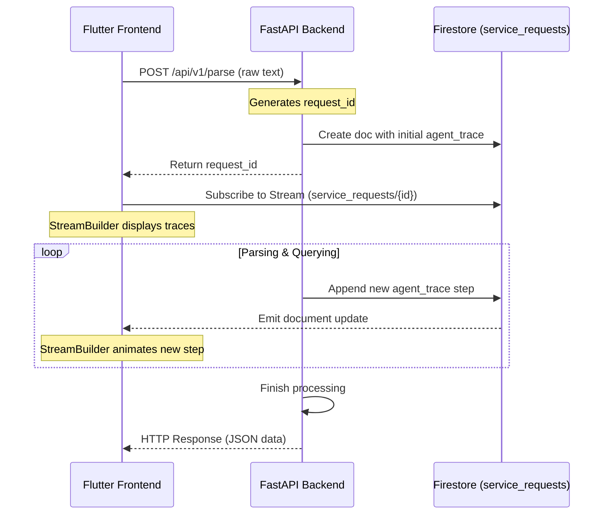

# Backend & Frontend Alignment Analysis

This document details the alignment between the backend implementation, system design documentation, and the Stitch UI specifications for the **Jugaad AI Service Orchestrator** project.

---

## 1. API Contract vs. Backend Route Alignments

The actual backend code routing is 100% aligned with the formal API contract (`docs/api_design.md`). Below is the mapping:

| Logical Operation | Documented Path (`docs/ui_and_antigravity.md`) | Actual Backend Route (`backend/app/api/endpoints/`) | Status |
| :--- | :--- | :--- | :--- |
| **Intent Parsing** | `/parse-request` | `/api/v1/parse` | **Aligned** |
| **Provider Search** | `/providers/search` | `/api/v1/search` | **Aligned** |
| **Booking Creation** | `/bookings/create` | `/api/v1/book` | **Aligned** |
| **Booking Tracking** | `/bookings/{booking_id}` | `/api/v1/booking/{booking_id}` | **Aligned** |
| **Follow-up Reminders** | `/followups/reminder` | `/api/v1/followup` | **Aligned** |
| **Request History** | `/history/requests` | `/api/v1/history/requests` | **Aligned** |
| **Booking History** | `/history/bookings` | `/api/v1/history/bookings` | **Aligned** |

> [!NOTE]
> We will configure our frontend API service calls to use the actual backend endpoints (`/api/v1/parse`, `/api/v1/search`, `/api/v1/book`, etc.).

---

## 2. Identified Conflicts & Action Plan

### Conflict A: Theme Colors Mismatch
*   **Stitch UI Definition:** Teal `#006768` (Primary) and Amethyst `#7543A7` (Tertiary).
*   **Current Theme Code:** Teal `#14B8A6` (Primary) and Amethyst `#9B59B6` (Secondary).
*   **Action:** Update constants in `lib/theme/app_theme.dart` to match Stitch's palette.

### Conflict B: Phone Number Formats
*   **Stitch UI Definition:** Welcome & profile screen placeholders use Indian format (`+91 00000 00000`).
*   **Backend & Data Seeds:** All backend mock providers and city clusters reside in Pakistan (`+92`).
*   **Action:** Change frontend placeholders and keyboard formatting to match standard Pakistani layout (e.g. `+92 300 0000000`).

### Conflict C: Parsed Intent Schema Nullability
*   **Backend Schema:** Fields like `urgency`, `location_text`, and `issue_summary` are nullable (`str | None = None`) to handle incomplete requests.
*   **Current Frontend Model:** Declares all fields as non-nullable.
*   **Action:** Update Flutter models (`parsed_intent.dart`) to make these fields nullable and handle defaults gracefully.

---

## 3. Implementation of the StreamBuilder Pattern

The real-time streaming of backend logic steps ("Thinking Screen") uses **Firestore** as a broker.

---

## 4. Key Questions & Decisions

> [!IMPORTANT]
> Please review and confirm your preference on these architectural details:
>
> 1. **Authentication Mode:** Since the backend validates tokens via Firebase Auth (`verify_id_token`), should we implement dummy authentication on the frontend (generating/mocking a fake JWT for dev purposes), or set up a live Firebase Phone/Google Auth integration?
> 2. **Animation Smoothness:** Should we introduce a brief artificial delay (e.g., 500ms) between Firestore trace updates in our stream provider to make the thinking step-timeline appear smooth and readable, or render it immediately as soon as Firestore fires?
