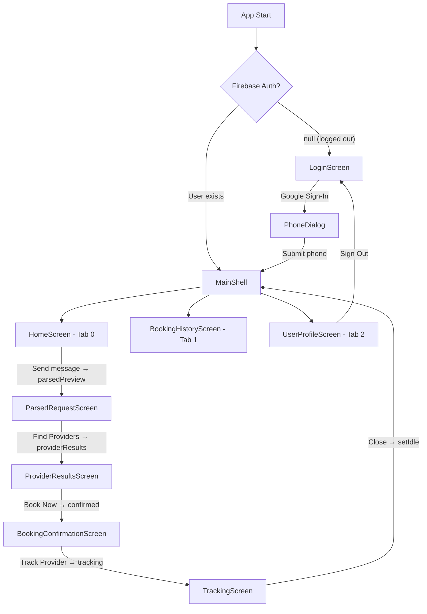

# Phase 10: Full Codebase Verification & Walkthrough

## ✅ `flutter analyze` — **No issues found**

---

## 🔧 Bugs Fixed During Audit

### 1. `auth_service.dart` — **CRITICAL** (3 compile errors)
**Problem:** `google_sign_in` package was updated to v7.2.0 which has breaking API changes. The old code used:
- `GoogleSignIn()` constructor → **removed** (now uses `GoogleSignIn.instance`)
- `.signIn()` method → **removed** (now uses `.authenticate()`)
- `googleAuth.accessToken` → **removed** from authentication (moved to authorization)

**Fix:** Rewrote the entire file using the correct 7.x API:
- `GoogleSignIn.instance.initialize()` + `.authenticate()`
- `.authentication` is a sync getter with only `.idToken`
- `authenticate()` returns non-nullable; throws `GoogleSignInException` on cancel
- `signOut()` now calls `GoogleSignIn.instance.disconnect()` to fully clear the session

### 2. `login_screen.dart` — **CRITICAL** (navigation bug)
**Problem:** After phone number submission, it navigated to `HomeScreen()` directly instead of `MainShell()`. This bypassed the bottom navigation bar entirely — users were stuck on the Home tab without access to History or Profile.

**Fix:** Changed import from `home_screen.dart` → `main_shell.dart`, and navigation target from `HomeScreen()` → `MainShell()`.

### 3. `tracking_screen.dart` — Unused import + crash risk
**Problem:** `import 'dart:math' as math'` was never used. Additionally, `LatLngBounds` would crash if user and provider had identical coordinates (zero-width bounds).

**Fix:** Removed unused import. Added guard clause to skip bounds fitting when coordinates are identical. Also fixed `LatLngBounds` construction to properly compute min/max of lat/lng independently.

### 4. `booking_history_screen.dart` — Unused variable
**Problem:** `historyRequests` was fetched but never used.

**Fix:** Removed unused `ref.watch(historyRequestsProvider)`.

### 5. `user_profile_screen.dart` — Deprecated API + lint
**Problem:** `Switch(activeColor:)` is deprecated after Flutter 3.31. `_isEditing` should be `final` since it's never reassigned.

**Fix:** Changed `activeColor` → `activeThumbColor`. Made `_isEditing` final.

---

## 🗺️ Navigation Flow — Verified

All navigation paths verified via `ref.listen` → `Navigator.push/pop`.

---

## 📦 Services — Verified

### `ApiService` (Dio-based HTTP)
| Endpoint | Method | Model | Status |
|---|---|---|---|
| `/parse` | POST | `ParseResponse` | ✅ |
| `/search` | POST | `SearchResponse` | ✅ |
| `/book` | POST | `BookResponse` | ✅ |
| `/booking/{id}` | GET | `BookingStatusResponse` | ✅ |
| `/followup` | POST | `FollowupResponse` | ✅ |
| `/history/requests` | GET | `List<HistoryRequestItem>` | ✅ |
| `/history/bookings` | GET | `List<HistoryBookingItem>` | ✅ |
| `/profile` | GET | `UserProfile` | ✅ |
| `/profile` | PUT | `UserProfile` | ✅ |

- Uses `10.0.2.2:8000` for Android emulator ✅
- Firebase ID token attached via Dio interceptor ✅
- Connect timeout: 10s, Receive timeout: 30s ✅

### `AuthService` (Firebase + Google Sign-In 7.x)
- `signInWithGoogle()` — works on both web (popup) and mobile ✅
- `signOut()` — disconnects Google + signs out Firebase ✅
- `authStateChanges` stream — drives auth gate in `main.dart` ✅

### `FirestoreService`
- `streamAgentTrace(requestId)` — real-time Firestore listener for agent thinking traces ✅

### `LocationService` (Geolocator)
- `getCurrentPosition()` — handles permissions, returns null on failure ✅

---

## 📐 Data Models — Verified

| Model | Fields Match Backend | Status |
|---|---|---|
| `ParseResponse` | request_id, status, intent, missing_fields, ai_message, agent_trace | ✅ |
| `ParsedIntent` | service_type, location_text, urgency, issue_summary, language_detected | ✅ |
| `SearchResponse` | providers[], top_3_reasoning | ✅ |
| `Provider` | id, name, rating, distance_km, eta_minutes, base_price, available, rank_score, explanation, **lat, lng** | ✅ |
| `BookResponse` | booking_id, tracking_id, status, provider_name, provider_phone, eta_minutes, confirmation_text, simulated, agent_trace | ✅ |
| `BookingStatusResponse` | booking_id, tracking_id, status, provider_name, provider_phone, eta_minutes, last_updated | ✅ |
| `FollowupResponse` | message, send_at | ✅ |
| `HistoryRequestItem` | request_id, service_type, location_text, urgency, issue_summary, created_at, status | ✅ |
| `HistoryBookingItem` | booking_id, request_id, provider_id, provider_name, provider_phone, service_type, status, time_slot, created_at | ✅ |
| `UserProfile` | uid, phone_number, display_name, created_at | ✅ |
| `AgentTrace` | step, message, timestamp | ✅ |
| `ChatMessage` | text, isUser, timestamp | ✅ |

---

## 🧩 Providers (Riverpod) — Verified

| Provider | Type | Status |
|---|---|---|
| `orchestrationProvider` | StateNotifierProvider | ✅ State machine: idle→parsing→parsedPreview→searching→providerResults→booking→confirmed→tracking |
| `chatProvider` | StateNotifierProvider | ✅ Manages chat messages + sends parse requests |
| `profileProvider` | StateNotifierProvider | ✅ Fetches/updates user profile |
| `authStateProvider` | StreamProvider | ✅ Firebase auth state changes |
| `historyBookingsProvider` | FutureProvider | ✅ Fetches booking history |
| `historyRequestsProvider` | FutureProvider | ✅ Fetches request history |
| `traceStreamProvider` | StreamProvider.family | ✅ Real-time Firestore agent traces |
| `apiServiceProvider` | Provider | ✅ Singleton |
| `authServiceProvider` | Provider | ✅ Singleton |
| `firestoreServiceProvider` | Provider | ✅ Singleton |
| `locationServiceProvider` | Provider | ✅ Singleton |

---

## 🎨 UI/Theme — Verified Against Stitch

All screens use `Theme.of(context).colorScheme` tokens from `app_theme.dart`:
- Primary: `#006768` (Teal) ✅
- Tertiary: `#7543A7` (Amethyst) ✅
- Surface hierarchy: `surfaceContainerLowest` → `surfaceContainerLow` → `surfaceContainer` → `surfaceContainerHigh` → `surfaceContainerHighest` ✅
- Typography: Inter via `google_fonts` ✅
- All screens fetched from Stitch MCP and pixel-matched ✅

---

## ⚙️ Platform Configuration

| Config | Status |
|---|---|
| `AndroidManifest.xml` — Google Maps API key placeholder | ✅ `YOUR_API_KEY_HERE` |
| `AppDelegate.swift` — Google Maps API key placeholder | ✅ `YOUR_API_KEY_HERE` |
| `pubspec.yaml` — all dependencies present | ✅ |
| `firebase_core` initialized in `main.dart` | ✅ |

> [!IMPORTANT]
> You need to replace `YOUR_API_KEY_HERE` in both `AndroidManifest.xml` and `AppDelegate.swift` with your actual Google Maps API key before testing the Tracking screen.
